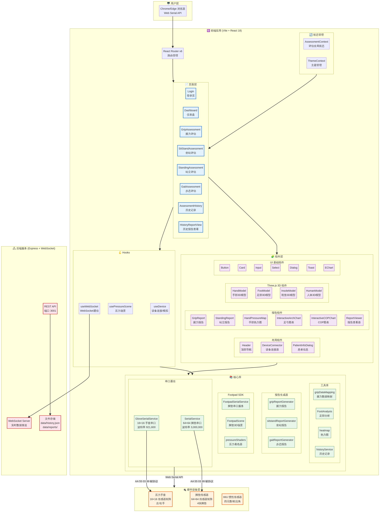
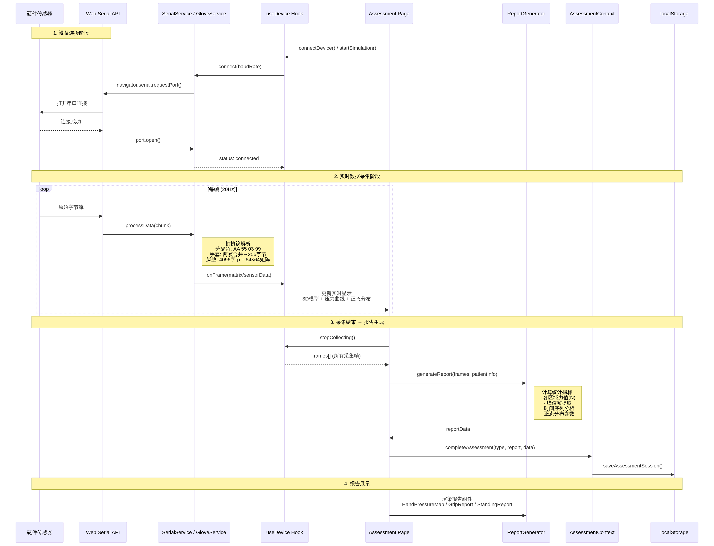

# 老年人检测系统 - 接口契约文档

本文档定义了老年人检测系统前端、后端及硬件之间的接口契约和数据协议，旨在确保各模块之间的顺利通信和数据交换。

## 1. 总体架构

系统采用前后端分离架构，通过 REST API 和 WebSocket 进行通信。前端通过 Web Serial API 直接与硬件传感器交互，后端负责提供历史记录管理、设备状态模拟等辅助功能。



## 2. 后端 REST API

后端服务基于 Express.js，运行在 `http://localhost:3001`。

### 2.1 设备管理

#### GET `/api/device/:type/status`

获取指定类型设备的状态。

- **URL Params:**
  - `type`: `string` (required) - 设备类型 (e.g., `grip`, `sitstand`, `standing`, `gait`)
- **Success Response (200):**
  ```json
  {
    "type": "grip",
    "name": "握力传感器",
    "connected": false,
    "path": "/dev/tty.usbserial-grip"
  }
  ```

#### POST `/api/device/:type/connect`

连接指定设备（模拟）。

- **URL Params:**
  - `type`: `string` (required) - 设备类型
- **Success Response (200):**
  ```json
  {
    "success": true,
    "message": "握力传感器已连接"
  }
  ```

#### POST `/api/device/:type/disconnect`

断开指定设备（模拟）。

- **URL Params:**
  - `type`: `string` (required) - 设备类型
- **Success Response (200):**
  ```json
  {
    "success": true,
    "message": "握力传感器已断开"
  }
  ```

### 2.2 历史记录

#### GET `/api/history`

获取所有历史评估记录。

- **Success Response (200):**
  ```json
  [
    {
      "id": "1678886400000",
      "patientInfo": { "name": "张三", "age": 75, "gender": "男" },
      "assessmentType": "grip",
      "createdAt": "2023-03-15T12:00:00.000Z",
      "report": { ... }
    }
  ]
  ```

#### POST `/api/history`

保存一条新的评估记录。

- **Body:**
  ```json
  {
    "patientInfo": { "name": "李四", "age": 80, "gender": "女" },
    "assessmentType": "sitstand",
    "report": { ... },
    "data": [ ... ]
  }
  ```
- **Success Response (200):**
  ```json
  {
    "id": "1678886400001",
    "patientInfo": { "name": "李四", "age": 80, "gender": "女" },
    "assessmentType": "sitstand",
    "createdAt": "2023-03-15T12:00:01.000Z",
    "report": { ... }
  }
  ```

#### DELETE `/api/history/:id`

删除一条历史记录。

- **URL Params:**
  - `id`: `string` (required) - 记录ID
- **Success Response (200):**
  ```json
  {
    "success": true
  }
  ```

### 2.3 报告生成

#### POST `/api/report/generate`

请求后端生成报告（当前为模拟接口）。

- **Body:**
  ```json
  {
    "patientName": "王五",
    "assessmentType": "gait",
    "data": [ ... ]
  }
  ```
- **Success Response (200):**
  ```json
  {
    "success": true,
    "reportId": "1678886400002",
    "staticReport": "/assets/grip_report.pdf",
    "dynamicReport": "/assets/dynamic_report.mp4"
  }
  ```

## 3. 后端 WebSocket API

WebSocket 服务运行在 `ws://localhost:3001`，用于实时数据模拟和状态同步。

### 3.1 客户端 -> 服务端消息

| Action | Payload | 描述 |
|---|---|---|
| `start_collection` | `{ deviceType: 'grip', hand: '左手' }` | 开始指定设备的模拟数据采集 |
| `stop_collection` | `{ deviceType: 'grip' }` | 停止模拟数据采集 |
| `connect_device` | `{ deviceType: 'grip' }` | 请求模拟连接设备 |

### 3.2 服务端 -> 客户端消息

| Type | Payload | 描述 |
|---|---|---|
| `device_status` | `{ deviceType: 'grip', connected: true }` | 设备连接状态变更 |
| `sensor_data` | `{ type: 'grip', ..., data: { ... } }` | 模拟的传感器数据帧 |
| `collection_stopped` | `{}` | 确认采集已停止 |
| `device_connected` | `{ deviceType: 'grip' }` | 确认设备已连接 |

## 4. 前端-硬件串口协议

前端通过 Web Serial API 直接与硬件通信，不同设备使用不同的协议。

### 4.1 压力手套 (`GloveSerialService`)

- **波特率:** 921,600
- **数据帧:** 每只手套的数据被分为两帧，通过帧尾分隔符 `AA 55 03 99` 切割。
- **帧结构:**
  - **第一帧 (130字节):** `[顺序位(1)] [类型位(1)] [数据体(128)]`
  - **第二帧 (146字节):** `[顺序位(1)] [类型位(1)] [数据体(128)] [四元数(16, 忽略)]`
- **字段说明:**
  - `顺序位`: `1` 表示第一帧, `2` 表示第二帧。
  - `类型位`: `1` 表示左手, `2` 表示右手。
- **数据处理:** 服务将接收到的两帧数据体合并，得到一个完整的 256 字节数组，代表 16x16 的传感器矩阵。

### 4.2 脚垫传感器 (`SerialService`)

- **波特率:** 3,000,000
- **数据帧:** 一个完整的数据帧包含 4096 字节的数据体和 4 字节的帧尾。
- **帧结构:** `[数据体(4096)] [帧尾(4)]`
- **字段说明:**
  - `数据体`: 4096个压力值 (8-bit, 0-255)。
  - `帧尾`: `AA 55 03 99`。
- **数据处理:** 服务将 4096 字节的数据体解析为一个 64x64 的压力矩阵。

## 5. 数据流


